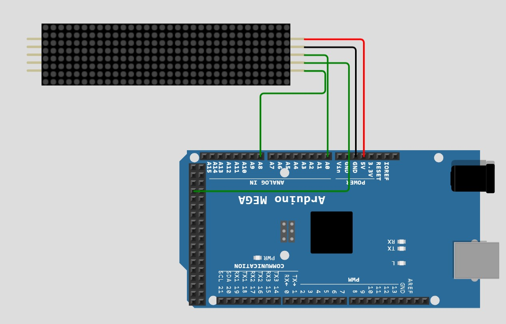
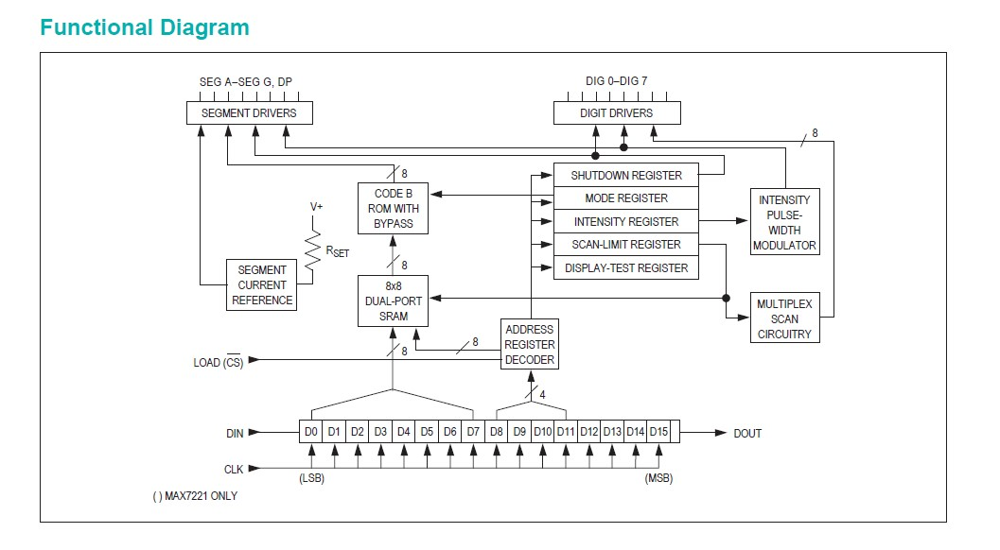
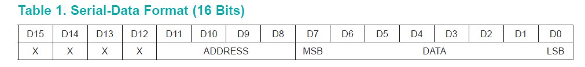
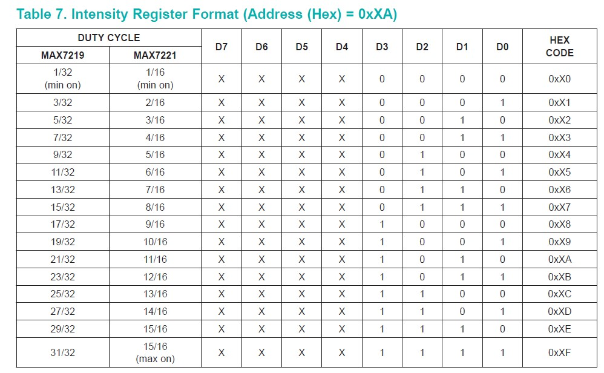
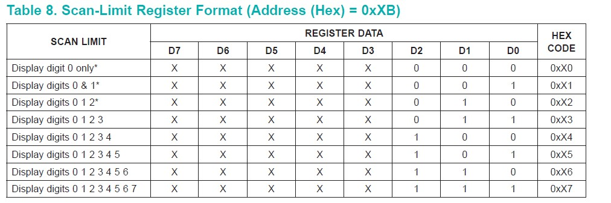
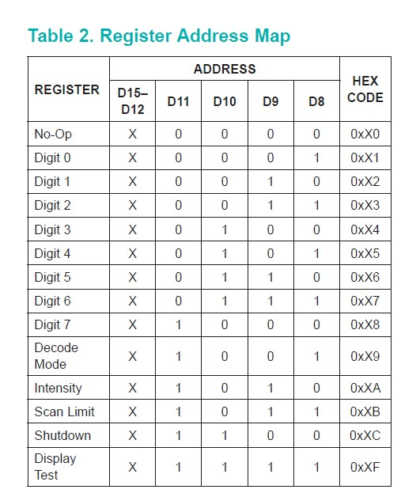

<body>
<h1>Working with Max721 dot matrix 4 in 1 using Atmega2560 (arduino mega) </h1>

<strong style="font-size:20px">
In this we will learn how to display characters (aplhabhets,numbers or any other symbol) using Max7219 dot matrix.
</strong>

<section>
<h2>Contents</h2>
<ul  style="background-color:#c5d4cc;padding-top: 10px;padding-bottom: 10px;">
<li><a href="#comp"><h3>Components</h3></a></li>
<li><a href="#connec"><h3>Connections</h3></a></li>
<li><a href="#max"><h3>About MAX7219 IC</h3></a></li>
<li><a href="#dot"><h3>Working with Max7219 Dot Matrix</h3></a></li>
</li>
</ul>
</section>

<section id="#comp">
<h2>Components</h2>
<table>
  <tr style="font-size: 24px;">
    <th>Component</th>
    <th>Quantity</th>
  </tr>
  <tr>
    <td><strong>Arduino Mega</strong></td>
    <td>1</td>
  </tr>
   <tr style="font-size: 24x;">
    <td><strong>Max7219 Dot matrix 4 in 1</strong></td>
    <td>1</td>
  </tr>
   <tr style="font-size: 24x;">
    <td><strong>Jumper Wires (M to F)</strong></td>
    <td>5</td>
  </tr>
</table>
</section>

<section id="connec">
<h2>Connections</h2>

<strong style="font-size:20px">
+V to 5V  
GND to GND  
Din to A0  
CS  to D49  
CLK to A8 

<section id="max">
<h2>About Max7219</h2>
<strong style="font-size:20px">
Max7219 is a serial input/output display driver interfaced with microcontrollers to drive 7-segment display,dot LED.

Serial-data is stored 16-bit internal shift register, Serial-data format of 16-bit contains data and address, lower 8-bits(D0-D7) are data , D8-D11 are address bits, rest are don't care.

Brightness can also be configured. It used to set the intensity level of the display.

Scan-limit is used to display to how many digits , as we are using 8 rows and columns of matrix, we'll set hex code to 0x07.

 
Decode mode is useful when using with 7-segment display, here we are using dot matrix, so we can set to zero.

For more info on Max7219, you can read datasheet from <a href="https://datasheets.maximintegrated.com/en/ds/MAX7219-MAX7221.pdf">here</a>

</strong>
</section>

<section id="dot">
<h2>Working with Dot Matrix<h2>
<strong style="font-size:20px">
Max7219 contains a 16-bit serial data register , that data will be sent through Din , each time data is sent clock should be high so that data is shifted into max7219 chip and to store the data in the register, Chip select pin pulled from high to low.   

let us understand the code

<code>
void enable()
{

  out_clk(0x01);
  delay1();
  out_clk(0x00);
  delay1();
}
</code>
This function is used to pull clock to high to low with certain delay, this function is called ,each time data is transmitted through Din.

<code>
void cs_high_low(){

  out_cs(0x01);
  delay1();
  out_cs(0x00);
}
</code>
This function is used to pull chip select pin from high to low, this function is called when we want data to be stored in register.

<code>
void send_Din(char addr,unsigned char data)
    {

    for(char i=7;i>=0;i--){
      out_din((addr>>i)&0x01);
      enable();
    }

    for(char i=7;i>=0;i--){
      out_din((data>>i)&0x01);
      enable();
    } 
    }
</code>
This function is used to send the 16-bit serial data bit by bit to the Din,address is sent to the register ,followed by the data each time a bit is sent enable function is called to pull the clock high to low. 

<code>#define shut_down   0x0C
#define brightness  0x0A
#define scan_limit  0x0B
#define decode_mode 0x09

char led_data1[8] = {0xFE,0x80,0x80,0xFE,0x80,0x80,0x80,0xFE};//'E' 
char led_data2[8] = {0xFE,0x80,0x80,0x80,0x80,0x80,0x80,0xFE};//'C'
char led_data3[8] = {0xFE,0x80,0x80,0xFE,0x80,0x80,0x80,0xFE};//'E' 
char led_data4[8] = {0x81,0xC1,0xA1,0x91,0x89,0x85,0x83,0x81};//'N'
</code>

We defined the address of shutdown mode,Intensity,scanlimit,decode mode.

Using char array we defined the symbols we want to send in the form of Hex.

<code>void setup() 
{

  init();
  out_cs(0x00);

  send_Din(scan_limit,0x07);
  send_Din(scan_limit,0x07);
  send_Din(scan_limit,0x07);
  send_Din(scan_limit,0x07);
  cs_high_low();

  send_Din(decode_mode,0x00);
  send_Din(decode_mode,0x00);
  send_Din(decode_mode,0x00);
  send_Din(decode_mode,0x00);
  cs_high_low();

  send_Din(brightness,0x01);
  send_Din(brightness,0x01);
  send_Din(brightness,0x01);
  send_Din(brightness,0x01);
  cs_high_low();

  send_Din(shut_down,0x01);
  send_Din(shut_down,0x01);
  send_Din(shut_down,0x01);
  send_Din(shut_down,0x01);
  cs_high_low();

  while(1){
   for(char i=1;i<9;i++){
      send_Din(i,led_data1[i-1]);
      send_Din(i,led_data2[i-1]);
      send_Din(i,led_data3[i-1]);
      send_Din(i,led_data4[i-1]);
    cs_high_low();
   }
  }

}
</code>

In main we set the scan limit,decode mode, brightness, shutdown mode.

Inside the while loop, we are sending the data using array to all the four dot matrix and after sending data to four matrices we enable the chip select by calling cs_high_low() function.

</strong>
</section>

<section>
<strong>For complete code click <a href="">here</a></strong>
</section>
</body>
